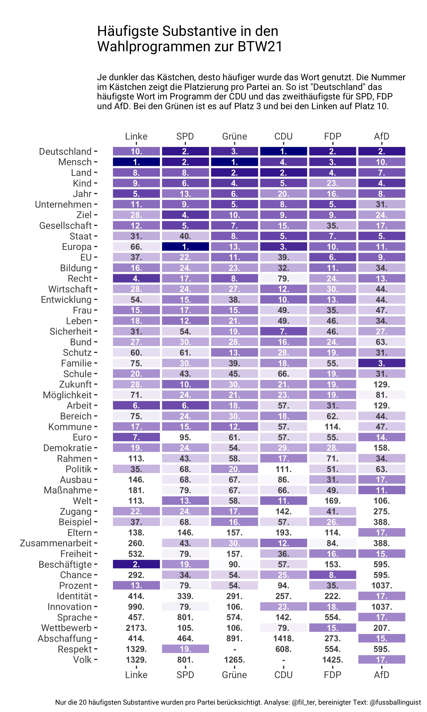

# Visualization of the most frequent words in the German federal election in 2021

  

## Install

1. `poetry install`
2. `python -m spacy download de_core_news_lg`
3. Download data: <https://github.com/Liebeck/spacy-iwnlp>

## Data

via: <https://github.com/fussballlinguist/btw21>

## License

Code: MIT

Graphic: CC BY
